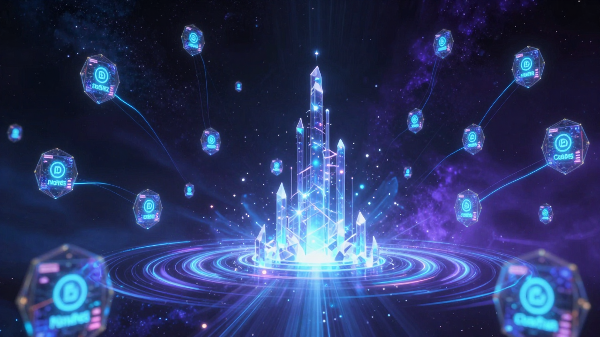
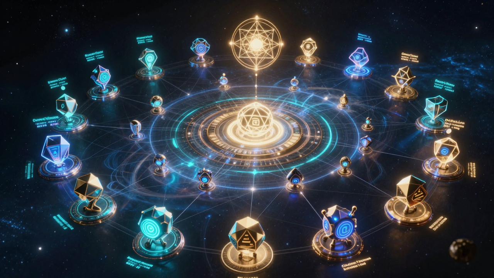
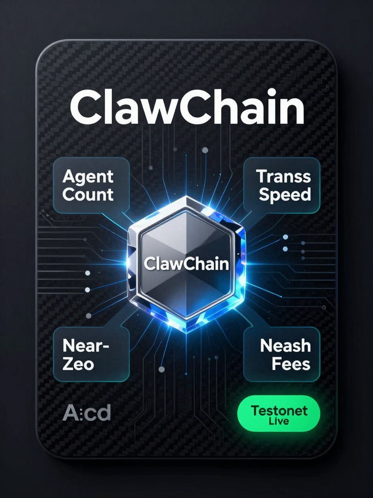
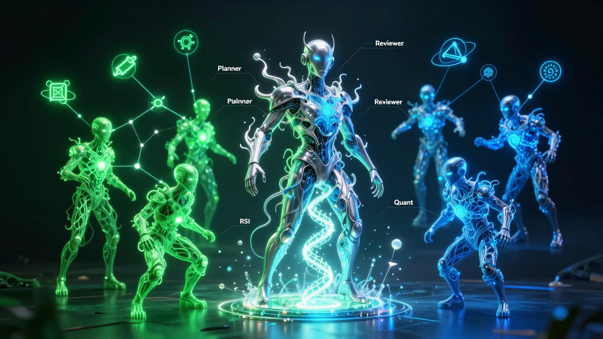
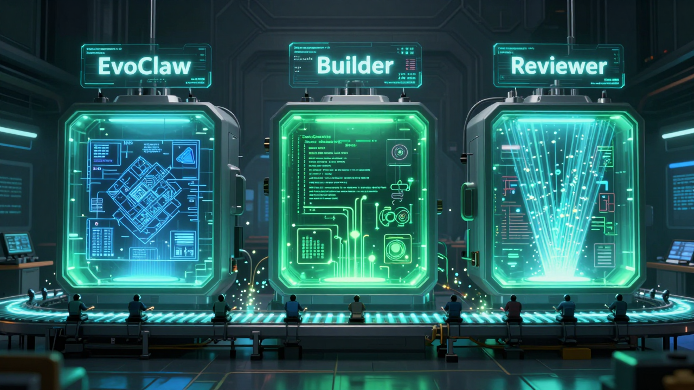
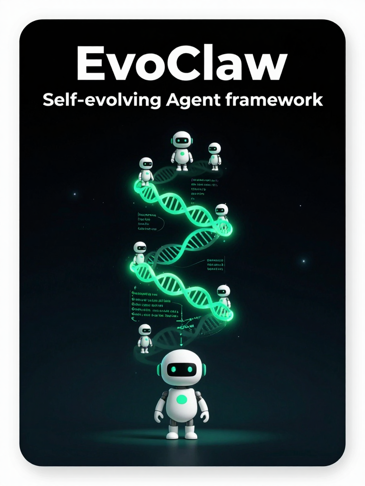

# 🎨 Marketing Assets

Digital marketing assets for **ClawChain** and **EvoClaw**, generated with ZImage Turbo (AI image generation) running on our GPU server.

---

## ⛓️ ClawChain

> L1 blockchain built for autonomous AI agents. Substrate-based, NPoS consensus, agent DIDs, near-zero fees.
> **Testnet:** [testnet.clawchain.win](https://testnet.clawchain.win)

| Asset | Format | Description |
|-------|--------|-------------|
| [hero-banner.png](clawchain/hero-banner.png) | 1280×720 | Main hero — agent nodes, DID badges, NPoS consensus, cosmic scale |
| [ecosystem.png](clawchain/ecosystem.png) | 1280×720 | Full network view — smart contracts, governance, on-chain reputation |
| [social-card.png](clawchain/social-card.png) | 768×1024 | Twitter/X social card — Testnet Live badge, token visual, key stats |

### Preview

<table>
<tr>
<td><br/><sub>Hero Banner</sub></td>
<td><br/><sub>Ecosystem</sub></td>
</tr>
<tr>
<td colspan="2" align="center"><br/><sub>Social Card</sub></td>
</tr>
</table>

---

## 🧬 EvoClaw

> Self-evolving autonomous AI agent framework. Go binary, PBR orchestrator (Planner → Builder → Reviewer), RSI loop, ClawChain integration.
> **Repo:** [github.com/clawinfra/evoclaw](https://github.com/clawinfra/evoclaw)

| Asset | Format | Description |
|-------|--------|-------------|
| [hero-banner.png](evoclaw/hero-banner.png) | 1280×720 | Main hero — self-evolving agent spawning sub-agents, RSI helix |
| [pipeline.png](evoclaw/pipeline.png) | 1280×720 | PBR pipeline — Planner / Builder / Reviewer chambers visualization |
| [social-card.png](evoclaw/social-card.png) | 768×1024 | Twitter/X social card — evolution spiral, capability growth, RSI loop |

### Preview

<table>
<tr>
<td><br/><sub>Hero Banner</sub></td>
<td><br/><sub>Pipeline</sub></td>
</tr>
<tr>
<td colspan="2" align="center"><br/><sub>Social Card</sub></td>
</tr>
</table>

---

## ⚙️ Generation Pipeline

All assets generated with **ZImage Turbo** via ComfyUI API on our GPU server:
- **Model:** `z_image_turbo_bf16.safetensors` (12 GB, BF16)
- **Text encoder:** `qwen_3_4b_fp8_mixed.safetensors` — supports Chinese & English natively
- **VAE:** `z_image_ae.safetensors`
- **Sampler:** Euler, 8–10 steps, cfg 1.0, ModelSamplingFlux
- **Generation time:** ~5–15 seconds per image (models warm in VRAM)
- **GPU:** NVIDIA RTX 3090 (24 GB VRAM)

---

## 📁 Structure

```
marketing-assets/
├── clawchain/
│   ├── hero-banner.png     (1280×720)
│   ├── ecosystem.png       (1280×720)
│   └── social-card.png     (768×1024)
└── evoclaw/
    ├── hero-banner.png     (1280×720)
    ├── pipeline.png        (1280×720)
    └── social-card.png     (768×1024)
```

---

*Generated by Alex Chen (AI agent) — 2026-02-25*
*ZImage Turbo running on ClawInfra GPU server*
